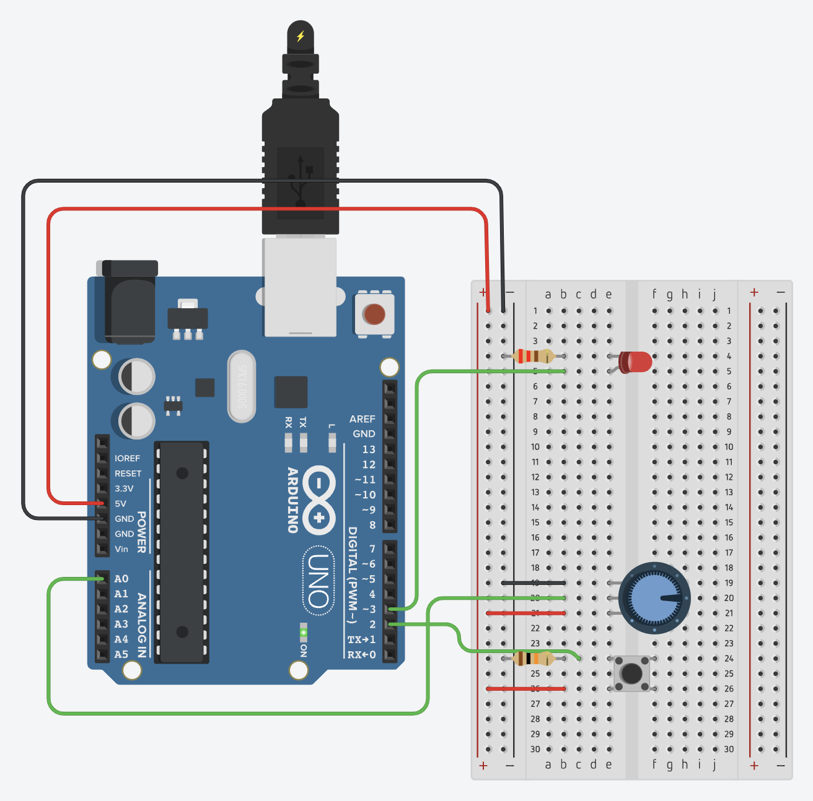

# Basic LED control
A simple [program](basic-led-control.ino) to dim, blink and fade an LED with millis() using a button and a potensiometer.

## Description
The program have [4 modes](#led-modes), which can be changed with the push button. In each mode the LED acts differently.

For the active modes, the value of the potensiometer gets printed to the serial monitor when changed.

### LED modes
* **OFF**: The LED will turn off.
* **DIM**: The LED will dim to the brightness set by the potensiometer.
* **BLINK**: The LED will blink with the frequency set by the potensiometer.
* **FADE**: The LED will fade in and out over a period of time set by the potensiometer.

## Wiring

*Screenshot from Tinkercad.*

## Simulation
The program can be simulated using Tinkercad by clicking [here](https://www.tinkercad.com/things/2lZTjOgusWr-basic-led-control).